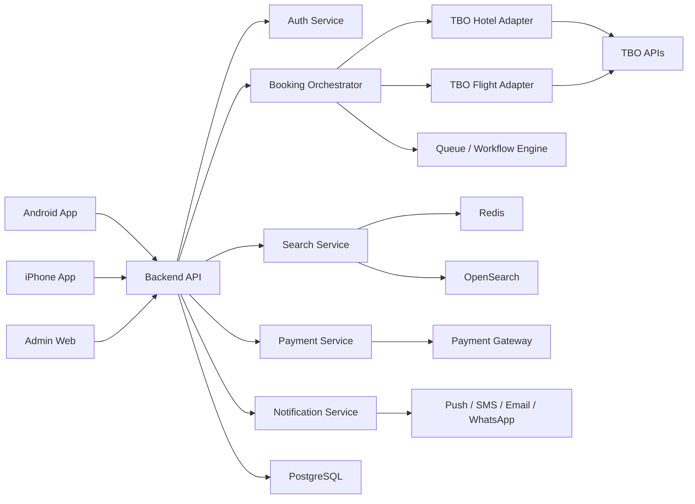

# ScanMyFlight

ScanMyFlight is planned as a full-stack travel booking platform powered by TBO APIs. The product goal is to build a MakeMyTrip-class experience for flights, hotels, holidays, buses, trains, cabs, insurance, visas, payments, offers, support, and business travel, with separate native apps for Android and iPhone.

## Vision

Build a modern travel super-app where customers can search, compare, book, manage, cancel, amend, and get support for an entire trip from one account. The backend should keep provider integrations replaceable, starting with TBO for hotels and flights, while allowing future suppliers for rail, bus, cabs, insurance, visa, forex, activities, and packages.

## Research Notes

The initial discovery used these public sources:

- TBO APIs overview: https://www.tbo.com/tbo-api
- TBO Holidays Hotel API v7 documentation: https://api.tbotechnology.in/AIS_APISpecification.aspx
- TBO Hotel Search: https://api.tbotechnology.in/AIS_Hotelsearch.aspx
- TBO Availability and Pricing: https://api.tbotechnology.in/AIS_Availabilityandpricing.aspx
- TBO Hotel Booking: https://api.tbotechnology.in/AIS_Hotelbook.aspx
- TBO certification process: https://api.tbotechnology.in/AIS_Going-live-certification.aspx
- TBO Flight XML/API overview: https://www.travelboutiqueonline.com/flight_api.aspx
- HDFC SmartGateway developer docs: https://smartgateway.hdfcbank.com/docs/
- HDFC SmartGateway product page: https://www.hdfc.bank.in/msme-banking/payment-gateway
- MakeMyTrip web/app feature references: https://www.makemytrip.com, https://play.google.com/store/apps/details?id=com.makemytrip, https://apps.apple.com/app/makemytrip-flight-hotel-bus/id530488359
- myBiz corporate travel references: https://mybiz.makemytrip.com

## Product Scope

### Customer Features

- Account signup/login with email, phone OTP, Apple, Google, and optional passkeys.
- User profile, saved travelers, saved GST details, saved addresses, saved payment methods, and notification preferences.
- Flight search for one-way, round-trip, multicity, domestic, and international routes.
- Flight filters for price, airline, stops, departure/arrival time, baggage, refundability, duration, layover, nearby airports, and fare type.
- Flight fare calendar, price alerts, fare lock/hold, flight status, gate/terminal updates, web check-in links, baggage and meal SSRs, seat selection, cancellation, reschedule, partial cancellation, refund tracking, and e-ticket downloads.
- Hotel search by city, area, landmark, hotel name, map, and nearby location.
- Hotel filters for price, star rating, amenities, meal plan, cancellation policy, payment type, guest rating, property type, couple friendly, business friendly, family friendly, location, and deals.
- Hotel details with photos, rooms, inclusions, taxes/fees, cancellation policy, hotel norms, reviews, map, nearby places, and similar stays.
- Hotel booking with guest details, GST invoice details, coupon, wallet, payment, voucher, cancellation, amendment, and support.
- Holiday packages with destination discovery, fixed packages, customizable packages, itinerary builder, flights plus hotels, transfers, activities, visa add-ons, and expert assistance.
- Bus booking with source/destination, operator filters, seat map, boarding/dropping points, live tracking where available, cancellation, and ticket download.
- Train booking discovery with PNR status, train running status, schedule, seat availability, fare, alternate trains, and IRCTC-compatible booking flow where licensing allows.
- Cab booking for airport transfers, outstation, hourly rentals, city rides, trip tracking, driver details, and invoice.
- Homestays, villas, apartments, resorts, hostels, guest houses, and service apartments.
- Activities and sightseeing experiences.
- Travel insurance add-ons.
- Visa assistance and document checklist.
- Forex/travel card lead flow.
- Offers, coupons, bank offers, loyalty wallet, referral credits, and personalized deals.
- Trips dashboard with upcoming, completed, cancelled, failed, and pending bookings.
- Multi-channel support: help center, chat, call request, ticketing, booking-specific support, refunds, and escalation timeline.
- Reviews and ratings for hotels, stays, buses, cabs, and package experiences.
- Notifications through push, SMS, email, WhatsApp, and in-app inbox.
- Multi-language and multi-currency support.
- Accessibility support for screen readers, dynamic type, contrast, and keyboard navigation where applicable.

### Business Travel Features

- Company accounts and employee profiles.
- Corporate travel policy rules by route, budget, hotel category, booking window, approval requirement, and department.
- Approval workflows for out-of-policy bookings.
- Corporate fares and preferred suppliers.
- GST-compliant invoices and tax reporting.
- Company wallet, credit limit, payment reconciliation, and expense export.
- Travel manager dashboard for spend, savings, cancellations, refunds, policy violations, and traveler safety.
- Role-based access for admin, finance, approver, employee, and support agent.

### Admin And Operations Features

- Booking management, supplier reference tracking, cancellation/amendment management, refund state tracking, and manual override controls.
- Customer support console with booking timeline, provider logs, payment logs, documents, notes, and escalation status.
- Offer/coupon management.
- Markup/commission management by product, route, supplier, channel, customer segment, and date range.
- Content management for banners, destinations, package pages, FAQs, and help articles.
- Supplier health dashboard with latency, errors, booking failure rate, price-change rate, and timeout rate.
- Finance dashboard for payments, settlements, invoices, credit notes, refunds, and reconciliation.
- Audit logs for admin actions and sensitive data access.

## TBO Integration Requirements

TBO credentials must stay on the backend only. Mobile apps should never call TBO directly.

### Hotel Flow

1. Search hotels using TBO `HotelSearch` or `HotelSearchWithRooms`.
2. Fetch room options with `AvailableHotelRooms` where needed.
3. Fetch cancellation policy using `HotelCancellationPolicy`.
4. Mandatory pre-book verification with `AvailabilityAndPricing`.
5. Create booking with `HotelBook`.
6. Fetch booking status with `HotelBookingDetail`, especially after timeouts or uncertain booking responses.
7. Generate invoice where required.
8. Support cancellation with `HotelCancel`.
9. Support amendments with `Amendment`.

### Flight Flow

Detailed flight method documentation must be obtained from TBO after partner onboarding. The app should still be designed around the standard flight lifecycle:

1. Airport/city search and route validation.
2. Flight availability/search.
3. Fare rules and baggage details.
4. Fare quote/revalidation before checkout.
5. SSR selection for baggage, meals, and seats where supported.
6. Passenger details and document validation.
7. Booking/PNR creation.
8. Ticketing.
9. Booking details, cancellation, reschedule, refund status, and support.

### Certification Needs

- Maintain request/response XML logs for every TBO method.
- Store certification test cases separately from production traffic.
- Produce workflow documentation for TBO sign-off.
- Keep provider logs searchable by booking ID, client reference number, session ID, and supplier reference.

## Recommended Technology Stack

### Mobile Apps

We will build two native apps:

- Android: Kotlin, Jetpack Compose, AndroidX, Kotlin Coroutines, Flow, Hilt, Room, Retrofit/OkHttp, Coil, Firebase Cloud Messaging, Google Maps SDK, Play Integrity API.
- iPhone/iOS: Swift, SwiftUI, Combine or async/await, SwiftData/Core Data, URLSession or Alamofire, Kingfisher/Nuke, APNs, Apple Maps or Google Maps SDK, Sign in with Apple.

Shared conventions:

- API contract generated from OpenAPI.
- Design system tokens shared through a common source of truth.
- Analytics event taxonomy shared across Android and iOS.
- Deep links and universal/app links for booking details, offers, payment return, and support.

### Backend

- Language/runtime: Node.js with TypeScript.
- Framework: NestJS or Fastify.
- API style: REST for mobile clients, internal event contracts for async workflows, OpenAPI for client generation.
- Provider adapters: isolated TBO hotel adapter, TBO flight adapter, payment adapter, notification adapter, and future supplier adapters.
- Queue/workers: BullMQ with Redis or Temporal for booking workflows, retries, cancellation, refunds, and notifications.
- Database: PostgreSQL.
- Cache: Redis.
- Search: OpenSearch/Elasticsearch for hotels, destinations, logs, and support search.
- Object storage: S3-compatible storage for tickets, vouchers, invoices, logs, and exported reports.
- Realtime: WebSocket/SSE for booking status and support updates.

### Payments And Finance

- Payment gateway: HDFC Bank SmartGateway.
- HDFC integration mode: use SmartGateway checkout SDK/API from the backend, with mobile apps receiving only backend-created payment session payloads, payment links, or checkout instructions.
- Supported payment methods to plan for: domestic and international cards, UPI, net banking, wallets, card EMI, cardless EMI, BNPL, payment links, and payment forms.
- Authentication/integration options to confirm during onboarding: SmartGateway SDK integration, API reference with JWT encryption, API reference with basic authentication, integration kit with basic auth, and Tranportal integration.
- Payment session creation: backend creates the ScanMyFlight order, creates the HDFC SmartGateway session/order server-to-server, stores the gateway order ID, and returns the approved checkout payload/link to Android or iOS.
- Payment status confirmation: never trust only the mobile redirect result. Confirm success/failure through HDFC Order Status API and payment webhooks before issuing tickets, hotel vouchers, invoices, or supplier confirmations.
- Webhooks: expose a signed, idempotent backend webhook endpoint for SmartGateway payment events; verify authenticity, persist raw payloads, and enqueue booking continuation or refund workflows.
- Refunds: use HDFC refund APIs for cancellations, failed bookings after payment success, partial cancellations, and support-led refunds. Track refund request, queued/submitted state, bank/gateway reference, expected settlement date, and final status.
- Reconciliation: import/download HDFC settlement and transaction reports into the finance dashboard, match them against internal payments/refunds/bookings, and flag mismatches.
- Payment retries: support retrying failed transactions against the same booking hold where supplier rules allow it, while preventing duplicate ticketing or duplicate hotel booking.
- Offers and affordability: design checkout to support HDFC SmartGateway offer engine, EMI, no-cost EMI, BNPL, dynamic currency conversion, and payment-method-specific discounts.
- Wallet/credits ledger with double-entry accounting principles.
- Refund tracking and reconciliation jobs.
- GST invoice generation.
- PCI-sensitive data should remain with payment providers; do not store raw card data.

### HDFC SmartGateway Payment Flow

1. Customer selects flight, hotel, package, bus, cab, or other product.
2. Backend creates an internal booking hold or pending booking intent.
3. Backend calculates payable amount, convenience fee, coupon, wallet deduction, taxes, and GST invoice metadata.
4. Backend creates an HDFC SmartGateway payment session/order.
5. Android or iPhone opens the HDFC checkout SDK/page using the backend-provided payload or payment link.
6. Customer completes payment through card, UPI, net banking, wallet, EMI, BNPL, or another enabled method.
7. HDFC redirects the customer to the app/web return URL and separately sends webhook events.
8. Backend confirms final status using HDFC Order Status API and webhook data.
9. Booking orchestrator proceeds with TBO booking/ticketing only after verified payment success.
10. If supplier booking fails after payment success, backend starts an automatic refund workflow and alerts support.
11. Finance reconciliation jobs compare HDFC settlements with internal ledger entries.

### Admin Web

- Next.js with TypeScript.
- Component library: shadcn/ui or MUI.
- Data fetching: TanStack Query.
- Charts: Recharts or ECharts.
- Auth: role-based admin auth with MFA.

### Infrastructure

- Cloud: AWS, GCP, or Azure.
- Containers: Docker.
- Runtime: Kubernetes or managed container services.
- CDN: CloudFront/Fastly/Cloudflare.
- Secrets: AWS Secrets Manager, GCP Secret Manager, or Vault.
- CI/CD: GitHub Actions.
- Infrastructure as Code: Terraform.
- Observability: OpenTelemetry, Prometheus, Grafana, Loki, Sentry.
- Security: WAF, rate limiting, bot protection, vulnerability scanning, dependency scanning, audit logs.

### Testing

- Unit tests for pricing, policies, validation, provider mapping, and booking state machines.
- Contract tests for mobile/backend APIs.
- Provider sandbox tests for TBO flows.
- Integration tests for payment, booking, cancellation, refund, notification, and invoice flows.
- End-to-end tests for mobile critical paths.
- Load tests for search and booking.
- Snapshot/golden tests for native app screens.

## Initial Architecture



## Key Data Models

- User
- Traveler
- Company
- TravelPolicy
- SearchSession
- FlightItinerary
- HotelSearchResult
- RoomRate
- Booking
- BookingSegment
- Payment
- Refund
- Invoice
- Coupon
- WalletLedgerEntry
- SupportTicket
- ProviderRequestLog
- ProviderResponseLog
- AuditLog

## Delivery Plan

### Phase 0: Foundation

- Finalize target markets, legal entity, TBO onboarding, HDFC SmartGateway onboarding, and compliance needs.
- Build design system and API conventions.
- Create backend skeleton, Android skeleton, iOS skeleton, and admin skeleton.

### Phase 1: Hotels MVP

- Hotel destination search.
- Hotel search and listing.
- Hotel details and rooms.
- Availability/pricing verification.
- Booking, voucher, cancellation policy, trip details, support ticket, and provider logs.

### Phase 2: Flights MVP

- Flight search and filters.
- Fare details and revalidation.
- Passenger details.
- Payment, booking, ticketing, cancellation/refund basics.

### Phase 3: Payments, Offers, And Trips

- Coupons, wallet, bank offers, invoices, refunds, booking timeline, notifications, and customer support console.

### Phase 4: MakeMyTrip-Parity Expansion

- Holidays, buses, trains, cabs, insurance, visa, forex, activities, reviews, loyalty, price alerts, fare calendar, fare lock, corporate travel, admin finance, and advanced analytics.

### Phase 5: Scale And Certification

- TBO certification pack.
- Load testing.
- Supplier fallback strategy.
- Observability hardening.
- Security review.
- Production launch checklist.

## Compliance And Risk Checklist

- TBO partner agreement and API certification.
- IRCTC/licensing requirements for train booking if booking is implemented.
- Bus/cab supplier commercial agreements.
- HDFC SmartGateway merchant onboarding, KYC, MID setup, settlement account setup, sandbox access, production credentials, webhook configuration, and refund permissions.
- GST invoice compliance.
- Data privacy policy and consent management.
- Secure storage for passports, visas, and identity documents if collected.
- PCI DSS scope control through hosted/tokenized payment flows.
- App Store and Play Store compliance.

## Repository Plan

Suggested future layout:

```text
apps/
  android/
  ios/
  admin-web/
services/
  api/
  workers/
packages/
  api-contracts/
  design-tokens/
  shared-types/
docs/
  product/
  architecture/
  tbo-certification/
infra/
  terraform/
  docker/
```

## Immediate Next Steps

1. Confirm whether Android and iPhone should be fully native or whether a shared framework like Flutter/React Native is acceptable.
2. Obtain TBO sandbox credentials and full flight API documentation.
3. Complete HDFC SmartGateway merchant onboarding, sandbox access, webhook setup, and production credential plan.
4. Scaffold backend, Android, iOS, and admin app folders.
5. Build the hotel MVP first because TBO hotel documentation is publicly detailed and certification requirements are clearer.
